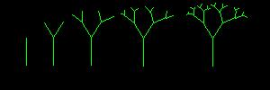

Fractal Tree
============

How to draw a tree  

  

Imagine you were describing how to draw a tree. You might say: 

* Draw a vertical line  
* At the top of the line, draw two smaller lines ("branches") in a v shape  
* At the ends of each of those two branches, draw two even smaller branches  
* Keep repeating the process, drawing smaller and smaller branches until the branches are too small to draw  

This process of repeating the same design at a continually decreasing scale is an example of a fractal. Using fractals to draw trees can give some interesting and beautiful patterns. In this assignment we will use a recursive branching function to create a fractal tree.

Suggested steps to completing this assignment:
----------------------------------------------
1. Fork and clone down this repository   

2. Run the program. It should draw a single green line on the screen. This will be the "trunk" of the Fractal Tree. Notice the three `private` variables. Changing the numbers in these `private` variables will change the appearance of the tree, i.e. how much smaller the branches are, how small the branches will get and the angle between the branches.
3. Now we'll write a function to draw the branches on the tree Here's some pseudocode describing the `drawBranches` function:  

	* declare two local `double` variables: `angle1` and `angle2`. These will hold the angles of the branches. Initialize one to `angle` plus `branchAngle` and the other to `angle` minus `branchAngle`. This will create the V shape of the branches.  
	* reduce `branchLength` by multiplying it by `fractionLength`. This will be the (shorter) length of the new branch.  
	* While the starting point of the new branches is just the endpoint of the previous branch or trunk, we'll have to use some trig to calculate the branches endpoints before we can draw them. Declare four local variables `endX1` `endY1` `endX2` `endY2`. We can calculate the endpoints with code like:

		`int endX1 = (int)(branchLength*Math.cos(angle1) + x);`  
		`int endY1 = (int)(branchLength*Math.sin(angle1) + y);`  
	* Now, draw two lines, both starting from (`x`,`y`) but ending at the two different end points you just calculated.  

4. Now go back to the `draw` function, and uncomment the call to `drawBranches`. You'll fill in the four arguments: `320` and `380` (the endpoint of the trunk is the starting point of the two branches) `100` (the length of the trunk) `3*Math.PI/2` (The angle of the trunk--a vertical angle in Java's system of radian measure). You should now see two branches in a V shape on the end of the trunk.
5. Now, the magic starts! We're going to use recursion to put branches on the branches! At the end of the `drawBranches` function write code so that if `branchLength` is larger than `smallestBranch`, `drawBranches` is called twice, once for each of the endpoints, e.g. (`endX1`,`endY1`). Be sure to use the two different angles for the two different branches. You should now see a fully formed Fractal Tree!

Extensions
----------------------
The program becomes more interesting when you can adjust `branchAngle` `fractionLength` and `smallestBranch`. You could add a `keyTyped()` function that allows the user to adjust those values and then call `redraw()` to draw the screen again.  

You could also have the width of the branches change with the length. You might introduce a little bit of randomness to the branch angles for more realism. You could even add a third, middle branch to make a more realistic looking tree or even more than 3 branches. There are many other types of Fractal Trees. The [Pythagorian Tree Fractal](https://www.google.com/search?q=pythagorean+tree+fractal&rlz=1C1GCEA_enUS746US746&tbm=isch&source=iu&ictx=1&fir=Cqa2cD0PwAdA3M%253A%252CcNzIL1jzRw-mDM%252C_&usg=__2-tcTkRaG0cJBK8XNHRxRO3GrGo%3D&sa=X&ved=0ahUKEwi4x8vg5cbZAhUIiFQKHazdAFoQ9QEIRTAF#imgrc=_) is another interesting variation. Browse the internet and see what ideas you can come up with, your fractal tree doesn't have to look like any other.

Samples of Student Work
-----------------------
[David](https://dactualchung.github.io/FractalTree/)   
[Mia](https://chenmia.github.io/FractalTree/)   
[Fred](https://fredxhua.github.io/FractalTree/)   
[Marisa](https://saeriam.github.io/FractalTree/)   
[Caitlin](https://caitlinchann.github.io/FractalTree/)   
[Alexis](https://alexisapcs.github.io/FractalTree/)   
[Emma](https://emmab3.github.io/FractalTree/)   
[William](https://willsamc16.github.io/FractalTree/)   
[Calvin](https://callmecalvin808.github.io/FractalTree/)   
[Brendan](https://brchao.github.io/FractalTree/)   
[Gordon](https://milkteadailo.github.io/FractalTree/)   
[Emil](https://emil000.github.io/FractalTree/)   
[Prescott](https://prescott00000.github.io/FractalTree/)   
[Ryan](https://someguy13.github.io/FractalTree/)   
[Mandy](https://mandy-wu.github.io/FractalTree/)   
[Benjamin](https://begilbert.github.io/FractalTree/)   
[Oona](https://oonarisseadams.github.io/FractalTree/)   
[Karlee](https://changkarlee.github.io/FractalTree/)   
[Tatiana](https://tgrishanina.github.io/FractalTree/)   
[Emma](https://emblenkinsop.github.io/FractalTree/)   
[Ashton](https://riseofthesaber.github.io/FractalTree/)   
[Cynthia](https://cylee1.github.io/FractalTree/)   
[Sherissa](https://sherissago.github.io/FractalTree/)   
[James](https://james168ma.github.io/FractalTree/)   
[Andrew](https://drewren25.github.io/FractalTree/)   
[Claudia](https://zixuanshao.github.io/FractalTree/)   
[Jasmine](https://jizeng2.github.io/FractalTree/)   
[Chanel](https://chan3l.github.io/FractalTree/)   
[Sarah](https://sarah2468.github.io/FractalTree/)   
[Jing](https://jili53.github.io/FractalTree/)   
[Warren](https://werren.github.io/FractalTree/)   
[Andy](https://8-man.github.io/FractalTree/)   
[Jeffrey](https://jechen27.github.io/FractalTree/)   
[Vincent](https://ss963213.github.io/FractalTree/)   
[Kelly](https://kellykelp.github.io/FractalTree/)   
[Lancy](https://lancytan.github.io/FractalTree/)   
[Jeffrey](https://jeffreythesloth.github.io/FractalTree/)   
[Kris](https://potato-krisu.github.io/FractalTree/)   
[Bryce](https://brycekeetonazaz.github.io/FractalTree/)   
[Yolanda](https://yofeng.github.io/FractalTree/)   
[Vivian](https://viviaann.github.io/FractalTree/)   
[Sophie](https://sohuang.github.io/FractalTree/)   
[Jenna](https://jennaralll.github.io/FractalTree/)   
[Andrew](https://ansue1234.github.io/FractalTree/)   
[Janet](https://birded.github.io/FractalTree/)   
[Ben](https://benjaminlanir.github.io/FractalTree/)   
[Robert](https://rshi159.github.io/FractalTree/)   
[Katie](https://kachow4.github.io/FractalTree/)   
[Erica](https://ericamalia.github.io/FractalTree/)   
[Brandon](https://brandontom96.github.io/FractalTree/)   
[Eric](https://jellybeanmill.github.io/OriginalFractal/)   
[Dillon](https://dillonlee27.github.io/FractalTree/)   
[Karen](https://sonokjw.github.io/FractalTree/)   
[Jenny](https://jeyu21.github.io/FractalTree/)   
[Nathan](https://nathansng.github.io/FractalTree/)   
[Dean](https://deanhuynh.github.io/FractalTree/)   
[Makoi](https://magacula1.github.io/FractalTree/)   
[Kenny](https://kennyyu168.github.io/FractalTree/)   
[Mi-Kaela](https://mikamarciales.github.io/FractalTree/)   
[Lydia](https://aqua28.github.io/FractalTree/)   
[Samantha](https://sammirustia.github.io/FractalTree/)   
[Schuyler](https://skschur1.github.io/FractalTree/)   
[Jayden](https://jaydenlee1229.github.io/FractalTree/)   
[Maxwell](https://12maxwellho.github.io/FractalTree/)   
[Arthur](https://arzhang.github.io/FractalTree/)   
[Otto](https://otschmidt.github.io/FractalTree/)   
[Andrew](https://andrewmai123.github.io/FractalTree/)   
[Nicholas](https://woonicholas.github.io/FractalTree/)   
[Michael](https://mipsim.github.io/FractalTree/)   
[Garvin](https://garvingit.github.io/FractalTree/)   
[Joanna](https://j0annalu.github.io/FractalTree/)   
[Tatiana](https://sonotatiana.github.io/FractalTree/)   
[Kenneth](https://kenpaso.github.io/FractalTree/)   
[Steve](https://sjkchang.github.io/FractalTree/)   
[Kirby](https://krbyktl.github.io/FractalTree/)   
[Winfield](https://winfield101.github.io/FractalTree/)   
[Joshua](https://joshualchan.github.io/FractalTree/)   
[Edmond](http://firework999363.github.io/FractalTree/)  
[Bryan](https://bzin22.github.io/FractalTree/)   
[Will](https://williammai.github.io/FractalTree/)   
[Elton](https://elel123.github.io/FractalTree/)   
[Emma](https://emmackenzie.github.io/FractalTree/)   
[Ryan](https://avath.github.io/FractalTree/)   
[Preston](https://prestonttt.github.io/FractalTree/)   
[Thanawat](https://thiskappaisgrey.github.io/FractalTree/index.html)   
[Aaron](https://aahuangithub.github.io/FractalTree/)   
[Nghi](https://nagirokudo.github.io/FractalTree/)   
[Andrea](https://chenandrea29.github.io/FractalTree/)   
[Hannah](https://hadecastro.github.io/FractalTree/)   

